# FilmIo
This is a simple app built consuming TMDB API to display movies and the details.

# Demo
## Dark Theme

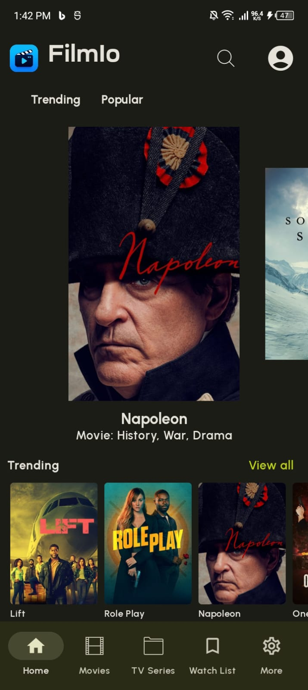  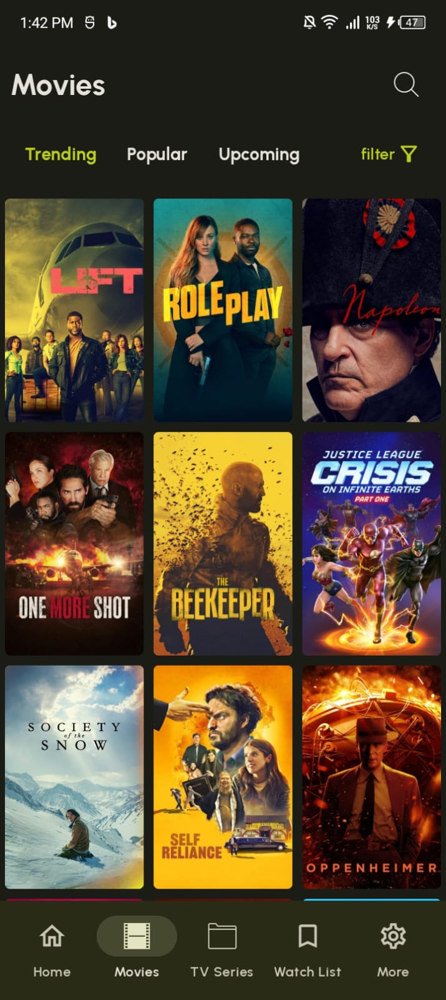  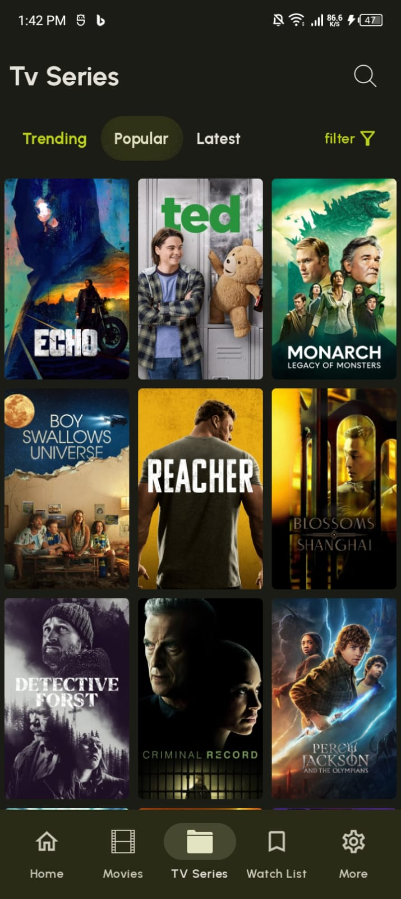

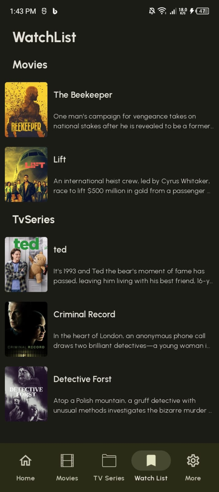  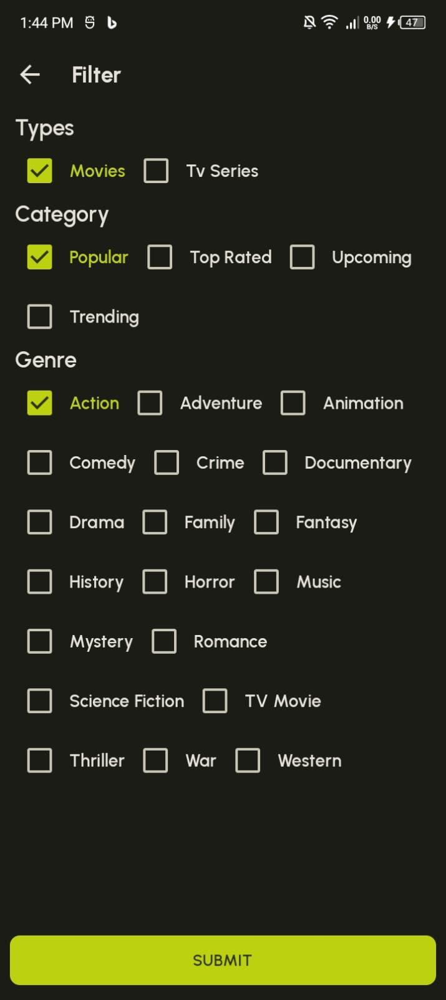  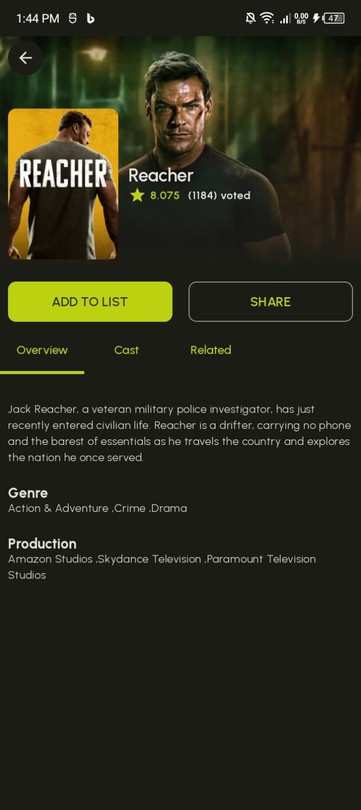

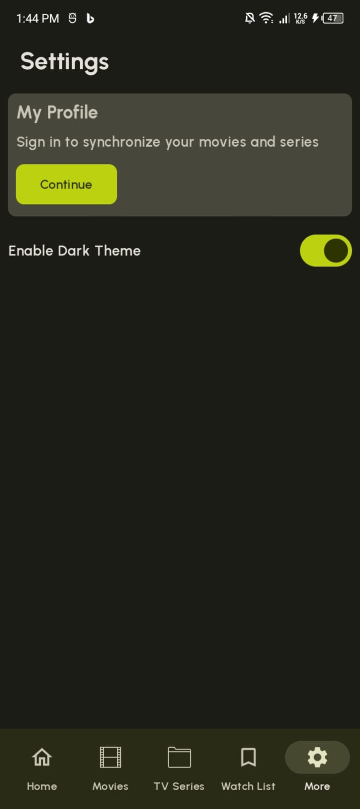  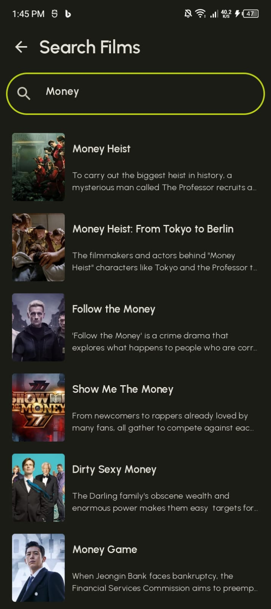  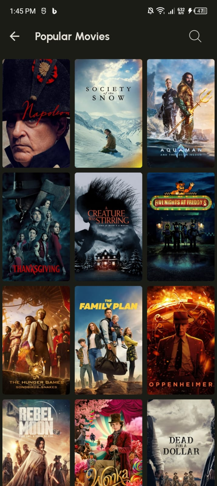

## Light Theme

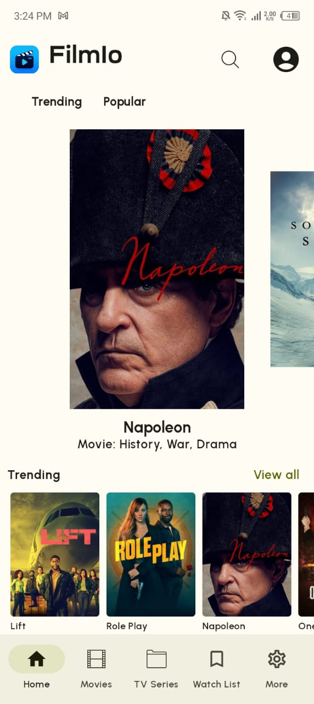  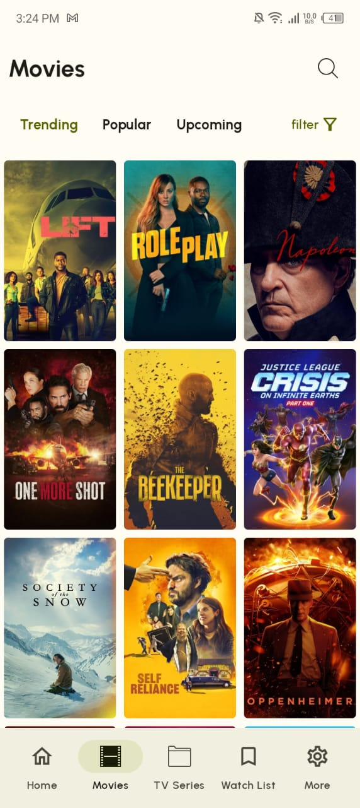  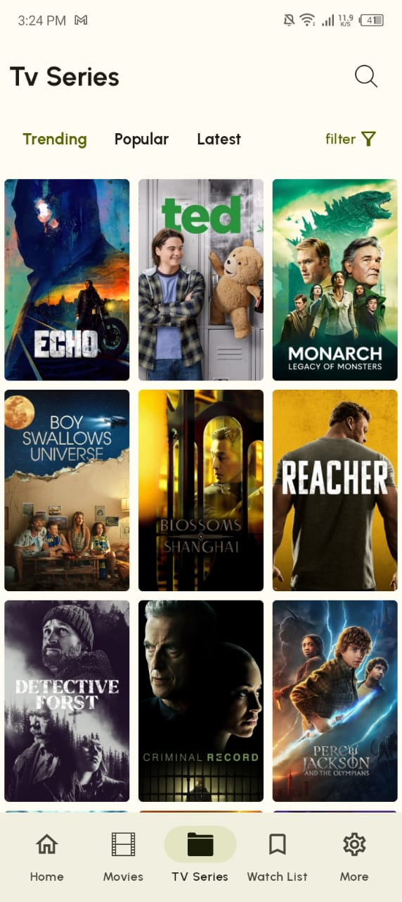

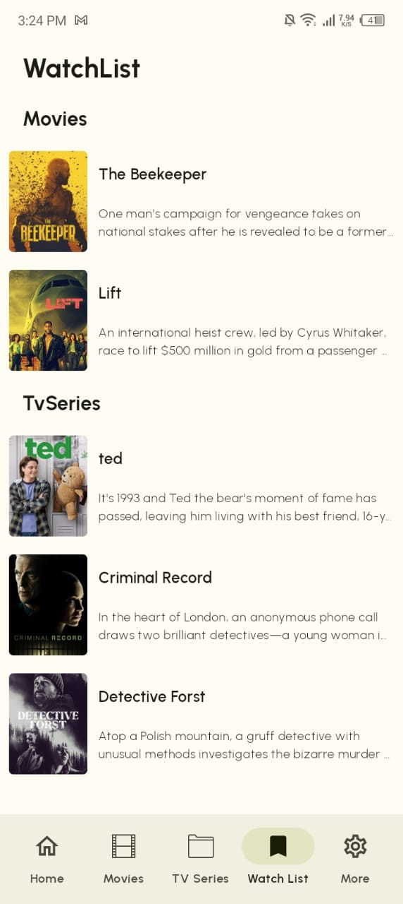  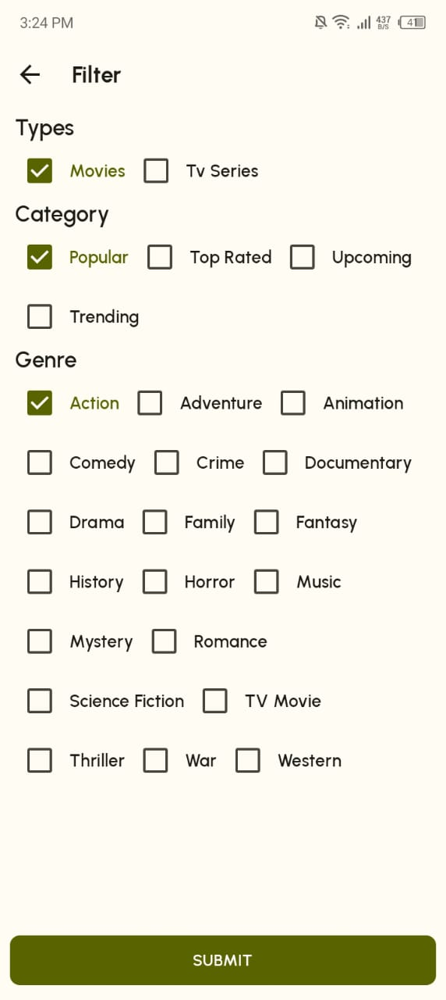  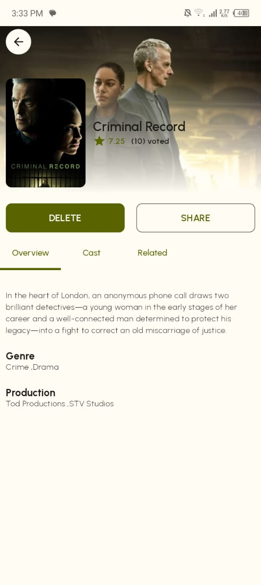

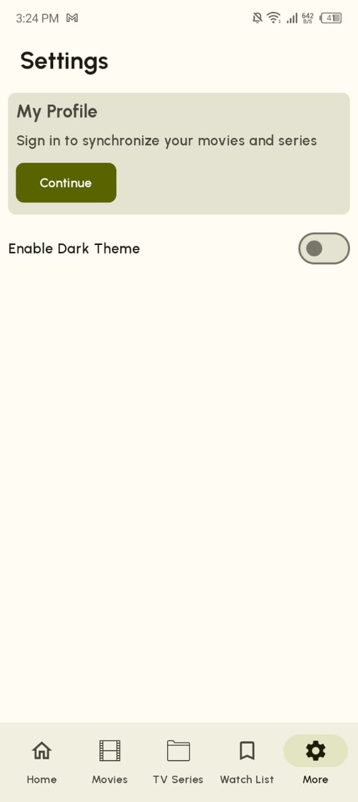  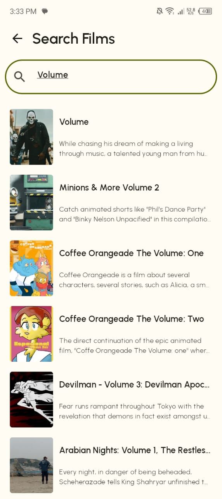  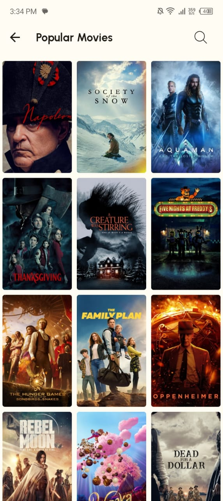

# App Architecture

# Tech Stack
- [Kotlin](https://developer.android.com/kotlin) - Kotlin is a programming language that makes coding concise, cross-platform, and fun. It is Google's preferred language for Android app development.
- [Jetpack Compose](https://developer.android.com/jetpack/compose) -  Android's recommended modern toolkit for building native UI. It simplifies and accelerates UI development on Android.
- [Paging 3 library](https://developer.android.com/topic/libraries/architecture/paging/v3-overview) - The Paging library helps you load and display pages of data from a larger dataset from local storage or over network. This approach allows your app to use both network bandwidth and system resources more efficiently.
- [Room database](https://developer.android.com/training/data-storage/room) - The Room persistence library provides an abstraction layer over SQLite to allow fluent database access while harnessing the full power of SQLite.
- [Preferences DataStore](https://developer.android.com/topic/libraries/architecture/datastore) - Jetpack DataStore is a data storage solution that allows you to store key-value pairs or typed objects with protocol buffers. DataStore uses Kotlin coroutines and Flow to store data asynchronously, consistently, and transactionally.
- [Navigation Compose](https://developer.android.com/jetpack/compose/navigation) - It is part of the Jetpack Navigation component tailored for use with Compose.
- [Material Motion Compose](https://github.com/fornewid/material-motion-compose) - Jetpack Compose library for implementing motion system in Material Components for Android and Compose Multiplatform.
- [Retrofit](https://square.github.io/retrofit) -  Retrofit is a REST client for Java/ Kotlin and Android by Square inc under Apache 2.0 license. Its a simple network library that is used for network transactions. By using this library we can seamlessly capture JSON response from web service/web API.
- [GSON](https://github.com/square/gson) - JSON Parser,used to parse requests on the data layer for Entities and understands Kotlin non-nullable and default parameters.
- [Kotlin Flow](https://developer.android.com/kotlin/flow) - In coroutines, a flow is a type that can emit multiple values sequentially, as opposed to suspend functions that return only a single value.
- [Dagger Hilt](https://developer.android.com/training/dependency-injection/hilt-android) - A dependency injection library for Android that reduces the boilerplate of doing manual dependency injection in your project.
- [Coil](https://coil-kt.github.io/coil/compose/)- An image loading library for Android backed by Kotlin Coroutines.
- [Timber](https://github.com/JakeWharton/timber)- A logger with a small, extensible API which provides utility on top of Android's normal Log class.
